<div class="MCWHeader1">
OSS DevOps
</div>

<div class="MCWHeader2">
Hands-on lab step-by-step
</div>

<div class="MCWHeader3">
August 2018
</div>

Information in this document, including URL and other Internet Web site references, is subject to change without notice. Unless otherwise noted, the example companies, organizations, products, domain names, e-mail addresses, logos, people, places, and events depicted herein are fictitious, and no association with any real company, organization, product, domain name, e-mail address, logo, person, place or event is intended or should be inferred. Complying with all applicable copyright laws is the responsibility of the user. Without limiting the rights under copyright, no part of this document may be reproduced, stored in or introduced into a retrieval system, or transmitted in any form or by any means (electronic, mechanical, photocopying, recording, or otherwise), or for any purpose, without the express written permission of Microsoft Corporation.

Microsoft may have patents, patent applications, trademarks, copyrights, or other intellectual property rights covering subject matter in this document. Except as expressly provided in any written license agreement from Microsoft, the furnishing of this document does not give you any license to these patents, trademarks, copyrights, or other intellectual property.

The names of manufacturers, products, or URLs are provided for informational purposes only and Microsoft makes no representations and warranties, either expressed, implied, or statutory, regarding these manufacturers or the use of the products with any Microsoft technologies. The inclusion of a manufacturer or product does not imply endorsement of Microsoft of the manufacturer or product. Links may be provided to third party sites. Such sites are not under the control of Microsoft and Microsoft is not responsible for the contents of any linked site or any link contained in a linked site, or any changes or updates to such sites. Microsoft is not responsible for webcasting or any other form of transmission received from any linked site. Microsoft is providing these links to you only as a convenience, and the inclusion of any link does not imply endorsement of Microsoft of the site or the products contained therein.

© 2018 Microsoft Corporation. All rights reserved.

Microsoft and the trademarks listed at https://www.microsoft.com/en-us/legal/intellectualproperty/Trademarks/Usage/General.aspx are trademarks of the Microsoft group of companies. All other trademarks are property of their respective owners.

**Contents**

<!-- TOC -->

- [OSS DevOps hands-on lab step-by-step](#oss-devops-hands-on-lab-step-by-step)
    - [Abstract and learning objectives](#abstract-and-learning-objectives)
    - [Overview](#overview)
    - [Solution architecture](#solution-architecture)
    - [Requirements](#requirements)
        - [Help references](#help-references)
    - [Exercise 1: Deploy the Web Application and Database to Azure](#exercise-1-deploy-the-web-application-and-database-to-azure)
        - [Task 1: Create the MySQL database](#task-1-create-the-mysql-database)
        - [Task 2: Restore the osTicket database to MySQL PaaS](#task-2-restore-the-osticket-database-to-mysql-paas)
        - [Task 3: Create the Web App](#task-3-create-the-web-app)
        - [Task 4: Configure the osTicket Web App](#task-4-configure-the-osticket-web-app)
        - [Task 5: Configure FTP deployment credentials](#task-5-configure-ftp-deployment-credentials)
        - [Task 6: Configure a staging slot](#task-6-configure-a-staging-slot)
        - [Summary](#summary)
    - [Exercise 2: Configure local Git repository](#exercise-2-configure-local-git-repository)
        - [Task 1: Clone a GitHub repository locally](#task-1-clone-a-github-repository-locally)
        - [Summary](#summary-1)
    - [Exercise 3: Configure Git and Jenkins for continuous integration, delivery and deployment](#exercise-3-configure-git-and-jenkins-for-continuous-integration-delivery-and-deployment)
        - [Task 1: Deploy a Jenkins server in Azure](#task-1-deploy-a-jenkins-server-in-azure)
        - [Task 2: Post-deployment configuration of the Jenkins server](#task-2-post-deployment-configuration-of-the-jenkins-server)
        - [Task 3: Configure Jenkins staging deployment](#task-3-configure-jenkins-staging-deployment)
        - [Task 4: Configure your GitHub repo to notify Jenkins of changes](#task-4-configure-your-github-repo-to-notify-jenkins-of-changes)
        - [Task 5: Check in a change to trigger Jenkins job](#task-5-check-in-a-change-to-trigger-jenkins-job)
        - [Task 6: Manually deploy to production](#task-6-manually-deploy-to-production)
        - [Summary](#summary-2)
    - [After the hands-on lab](#after-the-hands-on-lab)
        - [Task 1: Delete Resources](#task-1-delete-resources)

<!-- /TOC -->


# OSS DevOps hands-on lab step-by-step

## Abstract and learning objectives 

In this hands-on lab, you will implement a migration of a popular OS Support Ticket system from virtual machines, to an Azure PaaS solution with Web Apps, Azure Database for MySQL, as well as deploy Jenkins in an Azure virtual machine.

At the end of this hands-on lab, you will be better able to implement solutions that use complex open-source software (OSS) workloads using Azure.

## Overview

The scenario will challenge you to setup continuous integration and delivery of an application using open source tools such as Jenkins and GitHub along with automated deployments to Azure App Services. You will learn about continuous deployment and the benefits of staged publishing.

## Solution architecture


## Requirements

1.  An Azure subscription.

2.  A GitHub account.

### Help References
|    |            |       
|----------|:-------------:|
| **Description** | **Links** |
| Jenkins Documentation | <https://jenkins.io/doc/> |
| GitHub Documentation | <https://help.github.com/> |
| Azure Web Apps Documentation | <https://azure.microsoft.com/en-us/services/app-service/web/> |
| Azure Database for MySQL | <https://docs.microsoft.com/en-us/azure/mysql/> |
| Azure Database for MySQL | <https://docs.microsoft.com/en-us/azure/mysql/howto-create-manage-server-portal/> |
| Azure Database for MySQL | <https://docs.microsoft.com/en-us/azure/mysql/howto-manage-firewall-using-portal/> |
| Connect Azure Web App to Azure Database for MySQL | <https://docs.microsoft.com/en-us/azure/mysql/howto-connect-webapp/> |
| App Service for Linux | <https://docs.microsoft.com/en-us/azure/app-service/containers/app-service-linux-intro/> |
| Azure CLI | <https://docs.microsoft.com/en-us/cli/azure/install-azure-cli/> |


## Exercise 1: Deploy the Web Application and Database to Azure

Duration: 60 minutes

In this exercise, you will deploy the web application and database to Azure using Azure App Service and Azure Database for MySQL. The first steps will be to build the MySQL DB and then import the data using MySQL Workbench. Then, you will create the Azure Web App and connect it to GitHub to download the app using a Docker Container with PHP 7.0.

### Task 1: Create the MySQL database

1.  From the Azure portal, select on the Cloud Shell icon on the top navigation. Select Bash and mount a storage account if you already haven't done so.

    

2.  Execute the following command to create a resource group to contain the MySQL DB:

    ```
    az group create --name OsTicketPaaSRG --location "East US"
    ```

3.  Execute the following command to create a MySQL Database:

>**Note**: You must choose a unique name for the MySQL server. Replace **osTicketsrv01** with a more unique value.

    az mysql server create --resource-group OsTicketPaaSRG --name osticketsrv01 --location "East US" --admin-user demouser --admin-password demo@pass123 --sku-name B_Gen5_2 --storage-size 51200 --ssl-enforcement Disabled

4.  Add an open firewall rule to the database by executing the following command. Ensure you replace the server name with the unique value from the previous step.
    
    ```
    az mysql server firewall-rule create --resource-group OsTicketPaaSRG --server-name osticketsrv01 --name Internet --start-ip-address 0.0.0.0 --end-ip-address 255.255.255.255
    ```
5.  Once the MySQL database has been deployed, locate and open it from the **OsTicketPaaSRG** resource group using the Azure Portal.

6.  Choose **Connection Strings**.

    

7.  Locate the Web App script, and press the **Select the copy** button.

    

8.  Open a new notepad window and paste this into a new file to retain this string and more information in the next few steps. Update the **database** section to **osTicket** and the **password** section to **demo\@pass123**.

9. Select overview for the MySQL server.

    

10. Notice the **Server name** and **Server Admin Login** name. 

    

11. Replace the placeholders for **User Id=** and **Data Source=** in the connection string in notepad to the Server name and Server admin login name values.

    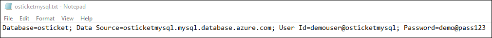

11. Scroll down, and notice that there are currently four databases that are running on your server.

    

### Task 2: Restore the osTicket database to MySQL PaaS

1.  Navigate to the following URL and download the associated file to a local folder **C:\\HOL**:

    <https://cloudworkshop.blob.core.windows.net/oss-devops/mysqlcluster.sql>

2.  On the **LABVM**, choose Start and then, locate the MySQL Workbench.

    

3.  Choose the Plus sign next to MySQL Connections on the Workbench.

    

4.  Enter the following information to configure to connect to your Server:

    -   Connection Name: **\<enter your MySQL Server DNS Name -- found in the connection string>**

    -   Connection Method: **Standard TCP/IP**

    -   MySQL Hostname: **\<enter your MySQL Server DNS Name -- found in the connection string \>**

    -   MySQL Server Port: **3306**

    -   Username: **\<enter your user name -- found in the connection string\>**

    -   Password: **Select Store in Vault: demo\@pass123**

        

5.  Once configured, choose the Test Connection Button.

    

6.  If configured correctly you will receive a message: **Successfully made the MySQL Connection**, select **OK**.

    

7.  Choose **OK** to save the connection that you just configured.

8.  The Connection will appear. Double-click to start a session with the MySQL database server running on the Azure PaaS.

    

9.  Once the Workbench loads, choose **Server Status**. Review the details of the MySQL PaaS Server.

    

10. This is the part of the lift and shift where we will restore the existing database for the application. Choose the **Data Import/Restore** button.

    

11. On the Data Import screen, select the **Import from Self-Contained File**, and select the **c:\\HOL\\mysqlcluster.sql** datafile (or wherever you stored the file you previously downloaded).

    

12. Choose new, next to the **Default Schema to be Imported To**.

    

13. On the Create Schema menu, type **osTicket** and select OK.

    

14. MySQL Workbench will create the Schema (database), on the server for you and select it as the Default Target Schema for the restore.

    

15. Choose **Start Import** after reviewing the screen.

    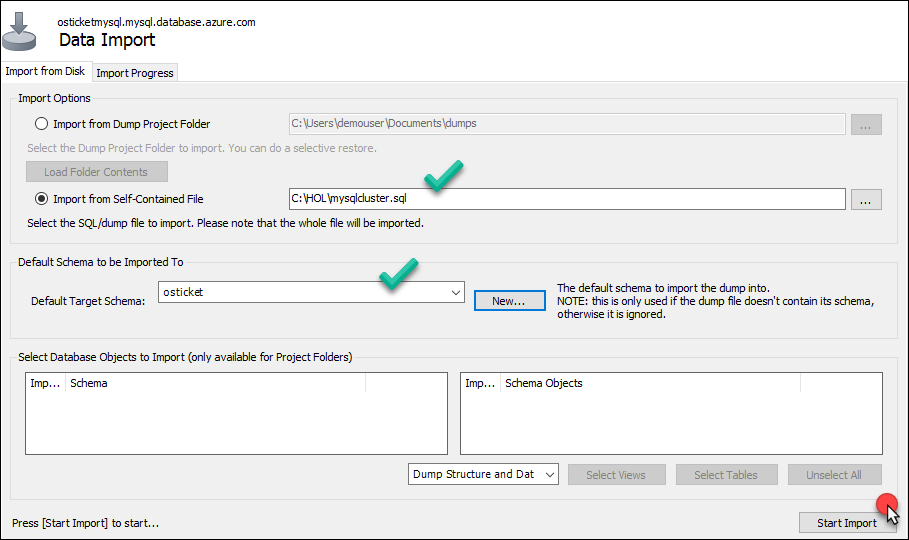

16. Once the restore is completed, the following screen will appear:

    

17. Move back to the Schemas area of the MySQL Workbench, and choose the refresh icon.

    

18. The tables of the database now appear since they have been restored. Locate the **ost\_user** table, **right-click**, and select **Select Rows -- Limit 1000**.

    

19. This will launch a query in the Workbench and list all the users on the system.

    

20. Move back to the Azure portal, and choose Overview for the MySQL server.

    

21. Scroll down and notice now, there are five databases and the addition of the **osticket**.

    

### Task 3: Create the Web App

1.  From the Azure portal, choose on the Cloud Shell icon on the top navigation.

    

2.  Execute the following command to create a Linux-based App Service Plan for the new web app:

    ```
    az appservice plan create -n OsTicket -g OsTicketPaaSRG --is-linux -l "East US 2" --sku S1 --number-of-workers 1
    ```

3.  Execute the following command to create a new web app configured for PHP 7.0 inside of the new app service plan. The name of the web app must be unique, so specify some numbers at the end to make it a more unique value.

    ```
    az webapp create -n osTicketsystem -g OsTicketPaaSRG -p OsTicket -r "php|7.0"
    ```

4.  Once the deployment has completed, open the **OsTicketPaaSRG** resource group. Notice there are now three objects: **MySQL database, Linux App Service Plan** and the **Web App**.

    

### Task 4: Configure the osTicket Web App

1.  Open the Web App using the Azure portal. Notice the details of the application including the **URL**.

    

2.  If you select the **URL**, the default webpage will load.

3.  In the Azure portal, select **Application settings** in the Settings area

    

4.  Locate the Connection Strings section. Choose **+ Add new connection string** and enter the name **osTicket** and copy the connection string from notepad into the **value area**. Select **MySQL** in the dropdown list next to the string. Select **Save**.

    

5.  Open a new browser tab and connect to <https://github.com/opsgility/osTicket>. This is a public repo for the OsTicket software. Sign in to your GitHub account or create a new one.

    

6.  On this page locate and then select the **Fork** button (upper corner).

    

7.  If prompted, select your personal account when prompted with **"Where should we fork this repository?"**

    

8.  After the repo is forked to your GitHub account, scroll down and locate the **include** folder and select it.

    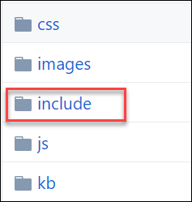

9.  Once in the **include** folder, scroll down and locate the file named **ost-config.php**.

    

10. The file will open in the browser. Select the **Pencil** icon to edit this file.

    

11. The file with open in an editor. Scroll down to the Database options area of the file. Update the text in this file with your MySQL database settings from your notepad file. The **DBHOST** name and the **DBUSER** should be updated. See below for the before and after comparison.

    Before:

    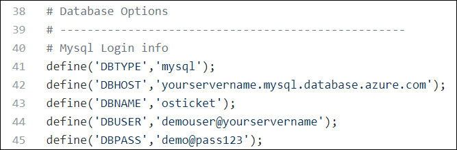

    After:

    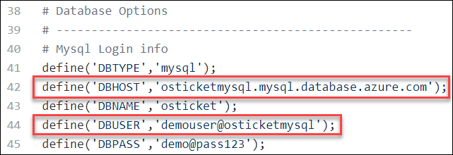

1. Once you have updated the text, scroll down enter a command and choose **Commit changes**.

    

### Task 5: Configure FTP deployment credentials 

Since you will be leveraging Jenkins to deploy the source code, you must first update the credentials that are used for an FTP deployment.

1.  In the Azure portal, choose **Resource groups \> OsTicketPaaSRG** and select the App Service to open the settings of the App Service.

2.  Select Deployment credentials, specify a globally unique username (**AppServiceFTPUser\<makethisunique\>**) / password (**demo\@pass123**), and choose **Save.** 

>**Note**: The username must be globally unique, so you may have to append some numbers to make it unique.

   

### Task 6: Configure a staging slot

1.  In the Azure portal, select **Resource groups \> OsTicketPaaSRG** and select the App Service to open the settings of the App Service.

2.  Choose **Deployment slots** under the **DEPLOYMENT** category.

    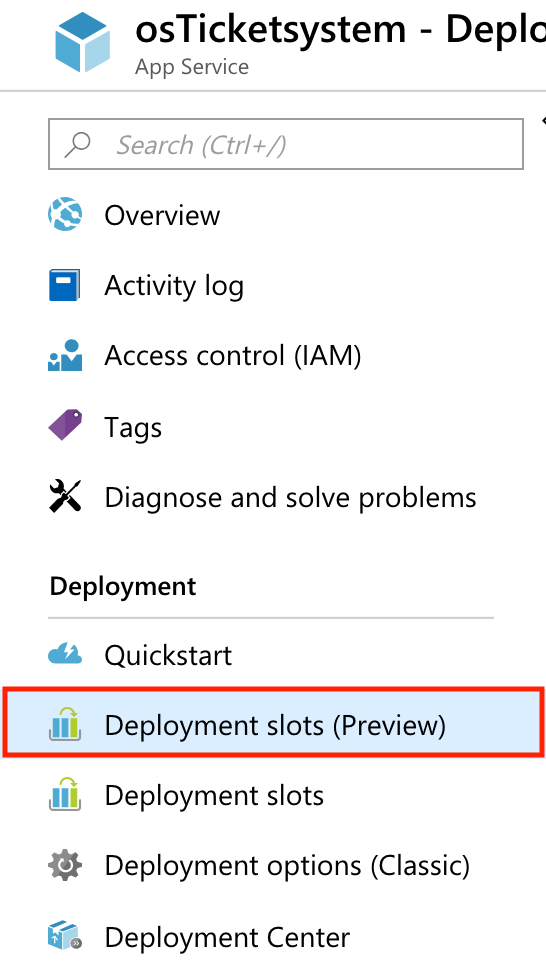

3.  Choose **Add Slot**.

    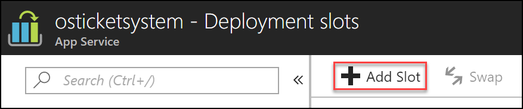

4.  Name the slot **Staging**, specify the primary site as the **Configuration Source** (this will copy over all the variables and their values we defined previously as well as the connection string), and select **OK** to create the deployment slot.

5.  Select on the deployment slot once it shows up in the list.
    
    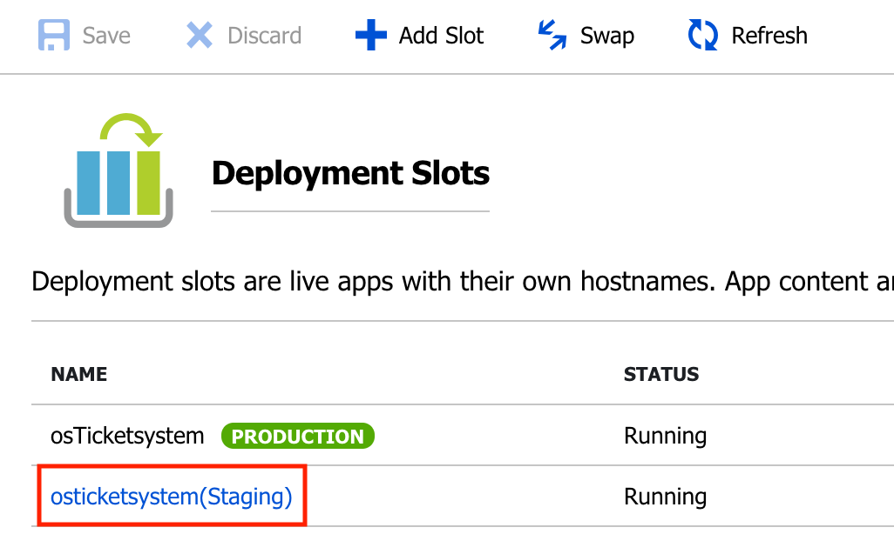

6.  Once the staging slot has been created, select its name. On the **Overview** link, choose on the **URL** from the staging slot's essentials pane.

    

7.  At this time, no code has been deployed to either production or the staging slot we just created. Both URLs will have the default website like the one below. You will be leveraging Jenkins and GitHub in the exercises that follow to deploy the website.

    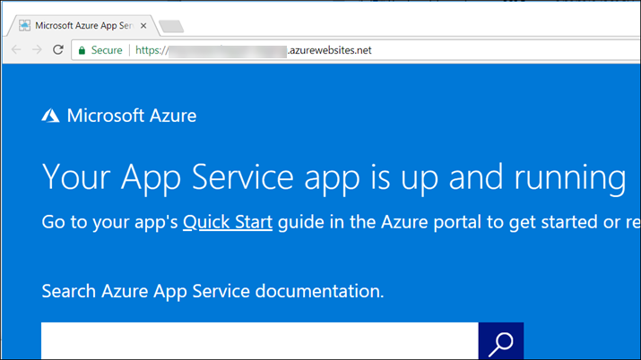

### Summary

In this exercise, you used several Azure Platform as a Service (PaaS) components to configure a Web Application. The Web App will use Azure Storage as well as MySQL for data. You also configured a staging slot for the Web Application with duplicate settings. The actual deployment of the Web Application will happen in an upcoming exercise.

## Exercise 2: Configure local Git repository

Duration: 10 minutes

In this exercise, you will use the forked GitHub repository from the previous exercise and clone it locally so that you can configure your web app.

### Task 1: Clone a GitHub repository locally

1.  Browse to <https://github.com/>, and login with your GitHub credentials.

2.  Navigate to the **osTicket** repository that you forked in the previous exercise.

3.  Clone the site locally on your computer for future changes by executing the commands and starting a console/terminal session containing the Git client.

    ```
    mkdir repos

    cd repos

    git clone https://github.com/[**YOUR_GITHUB**_**USERNAME**]/osTicket
    ```

### Summary

In this exercise, you forked a GitHub repository and cloned it locally, so you can configure your web app.

## Exercise 3: Configure Git and Jenkins for continuous integration, delivery and deployment

Duration: 90 minutes

In this exercise, you will configure a Jenkins server in Azure and leverage it along with Git to setup continuous integration & delivery of your Web Application. You will be pulling source code from a GitHub repository and configuring Jenkins to build and deploy the code to your Staging slot before it is pushed to production (manually).

### Task 1: Deploy a Jenkins server in Azure

Jenkins is an open source continuous integration tool written in Java. It provides continuous integration services for software development. It is a server-based system running in a servlet container such as Apache Tomcat. In this exercise, you will deploy a Jenkins Server in Azure leveraging a prebuilt virtual machine image from the Azure marketplace.

1.  If you are leveraging a virtual machine in Azure as your lab machine, first connect to it via RDP Otherwise to deploy a Jenkins Server instance in Azure, browse to <https://portal.azure.com>. Choose **+Create a resource**, type **Jenkins** in the search box, and hit **Enter**.

    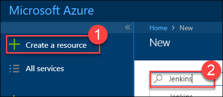

2.  You will notice that there are numerous preconfigured Jenkins servers available in the marketplace, for the purposes of the labs, choose the one submitted by **Microsoft** and select **Create**.

    

3.  Specify the following on the **Basics** blade, and choose **OK:**

    -   Name: **jenkins**

    -   User name: **demouser**

    -   Password: **demo\@pass123**

    -   Resource group: **JenkinsRG**

    -   Location: **Location nearest you.**

        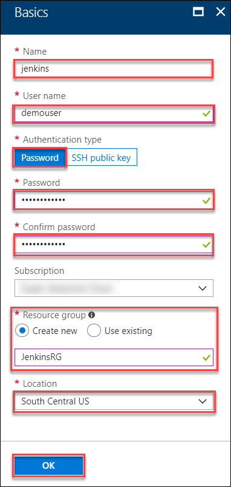

4.  This will present the **Additional Settings** blade. Select **Size** and choose the **DS1\_V2 Standard** size for the VM, and choose **Select.**
    
    

5. Choose the **Virtual network** field and choose **Create new**. On the new dialog set the **Address space** to **10.0.0.0/16**.

    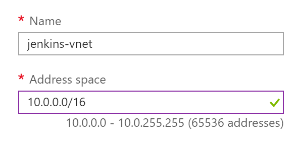


5.  Choose the **Configure subnets** field to view the existing subnet configuration and leave the values to the defaults and select **OK**. Then, enter a unique name in the **Domain name label field**, and choose **OK** on the **Additional** **Settings** blade.

    

6.  On the **Integration Settings** blade, leave the default values, and select **OK**.

7.  Choose **OK** on the **Summary** blade, and then select **Create** on the **Buy** blade to start the provisioning of your Jenkins server.

    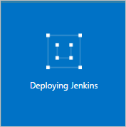

### Task 2: Post-deployment configuration of the Jenkins server

Go to the Overview page of the Jenkins VM, copy the DNS name, and open the URL in the browser (for example, [http://osTicketjenkins.southcentralus.cloudapp.azure.com/](http://osticketjenkins.southcentralus.cloudapp.azure.com/)). The Jenkins console is inaccessible through unsecured HTTP so instructions are provided on the page to access the Jenkins console securely from your computer using an SSH tunnel. After that, you will update the OS and Jenkins to the latest as well as install other tools needed for our scenario.

1.  Using the FQDN you defined in the previous exercise, browse to your Jenkins portal.

    

2.  Set up the tunnel by opening a PowerShell command prompt on your local computer and copying the ssh command on the browser page from the command line replacing username with the name of the virtual machine admin user chosen earlier.

    ```
    ssh -L 127.0.0.1:8080:localhost:8080 demouser@{yourvmname}.{yourvmregion}.cloudapp.azure.com
    ```

3.  When prompted, enter the password you previously chose. Keep the command line window open.

4.  Get the initial password needed for the next step by running the following command in the command line while still connected through SSH:

    ```
    sudo cat /var/lib/jenkins/secrets/initialAdminPassword
    ```
5.  Copy the password shown to your clipboard, as you will need it to initially login to the Jenkins interface.

6.  Open a web browser, and navigate to <http://localhost:8080/> on your local machine. If a **Getting Started** window is presented, choose the **X** in the top of the screen to close it. Then, select the **Start using Jenkins** button.

    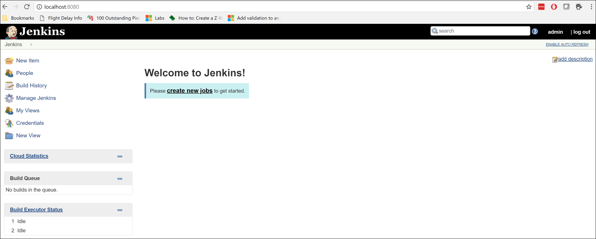

7.  Once logged into the portal, notice the version of Jenkins (**2.107.2** as of the writing of this lab). Choose **Manage Jenkins** for more details.

    

8.  Here, you will get more information on any update that may be available for the server instance itself or for Plugins.

9.  Select **Manage Jenkins** on the left-hand side followed by **Manage Plugins**.

    

10. There are three Plug-Ins you need to install for the next exercises. Choose the Available tab, and type **github** in the Filter field. Select the check box for **GitHub**, and choose **Install without restart**. Its version is at 1.29.0 as of this writing. You may need to scroll down to find it.

    

11. Next, choose the Available tab and type **Workspace Cleanup**. Choose the check box for **Workspace Cleanup Plugin** and select **Install without restart**.

    

12. Next, choose the Available tab, and type **ftp**. Select the check box for **Publish Over FTP**, and choose **Download now and install after restart.**

    

13. Check the box to Restart Jenkins.

    

14. Once the restart has completed, you will be redirected to the login page once again. (*You may need to refresh the browser page to update the install status.*)

15. Log back into Jenkins portal with the **admin** account using the password you copied earlier.

16. Navigate to **Manage Jenkins** followed by **Global Tool Configuration**.

    

17. Under **Git**, ensure the **Name** is set to ***Default***, and the **Path to Git executable** is set to ***git**.

18. Select **Save**.

### Task 3: Configure Jenkins staging deployment

You are now ready to define your staging deployment job.

1.  Login to your Jenkins portal with the **admin** account.

2.  You will first configure your FTP Plugin with the information from your Azure App Service. Choose **Manage Jenkins** followed by **Configure System.**

    

3.  Scroll down to the section titled **Publish over FTP**, and choose **Add**.

    

4.  The information that is needed here can be obtained from the settings of the App Service in Azure. Since you will be deploying to the Staging slot, be sure to get the information from the staging slot settings.

>**Note**: The only difference between the different slots is the username. The FTP URL is the same.


5.  Update the Plug-In settings with the following information, and choose **Save** (after confirming the connection is successful by selecting **Test Configuration**):

    -   Name: **Staging Slot for Web App**

    -   Hostname: \<**ftp hostname from web app staging slot settings**\>

    -   Username: \<**username from web app staging slot settings**\>

    -   Password: **demo\@pass123**

        

6.  On the Welcome page, select the **create new jobs** link.

    

7.  Choose **Freestyle project** and name the project **Deploy to Staging**, and choose **OK**.

    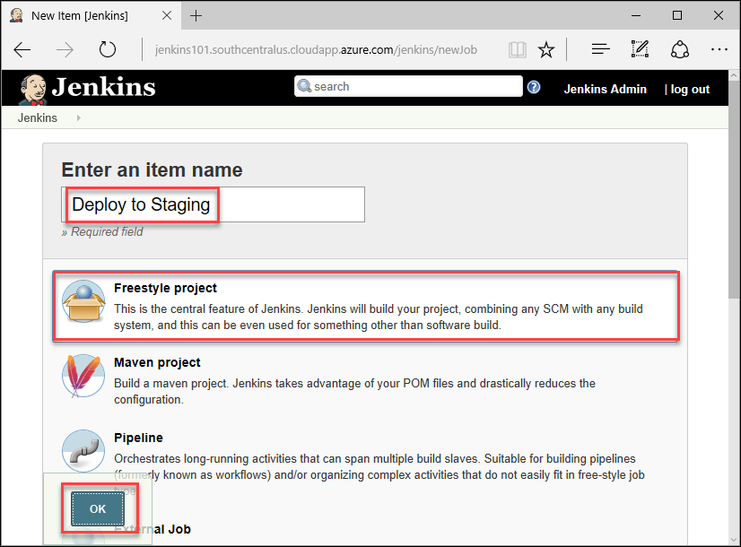

8.  In the **Source Code Management** section, choose Git and specify your GitHub repository URL. Choose **Add** to configure your credentials.

    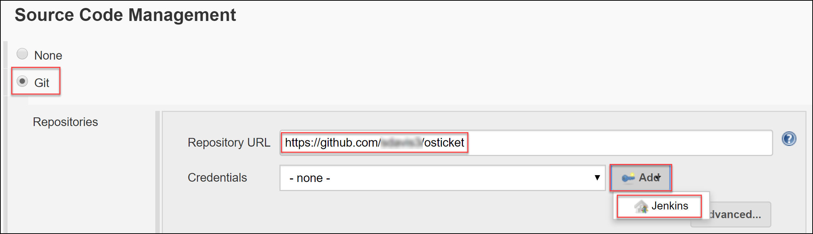

    

    

9.  In Build Triggers, check **GitHub hook trigger for GITScm polling**.

    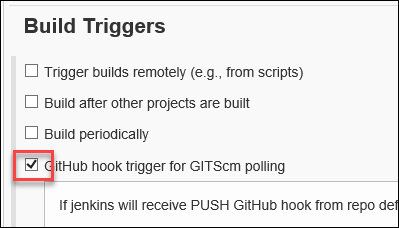

10. In the **Build** section, from the **Add build step** dropdown list, choose **Send files over FTP**. Be sure to choose the FTP you defined earlier, specify **\*\*** for the **Source files** and **/site/wwwroot** for the **Remote directory**.

    

11. Choose **Save** to save your changes.

    

12. Although you specified to run this project whenever a check-in was done in GitHub, you can force the job to run. Choose **Build Now** on the project page.

    

13. You will see an entry in Build History with your build number. Hover over the number to get a dropdown list of options. Choose **Console Output**.

    

14. Review the Console Output for any errors etc. You can see in the Console Output where the call to your GitHub repo is made and where it is synced on your Jenkins server. You can also see the commands specified and their output.

    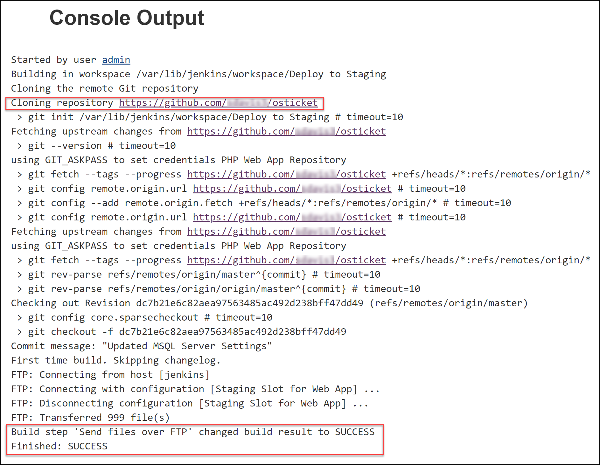

15. Once the job has completed, you can verify the deployment by browsing to the URL of the staging slot.

    

16. You will notice the site has been deployed.

    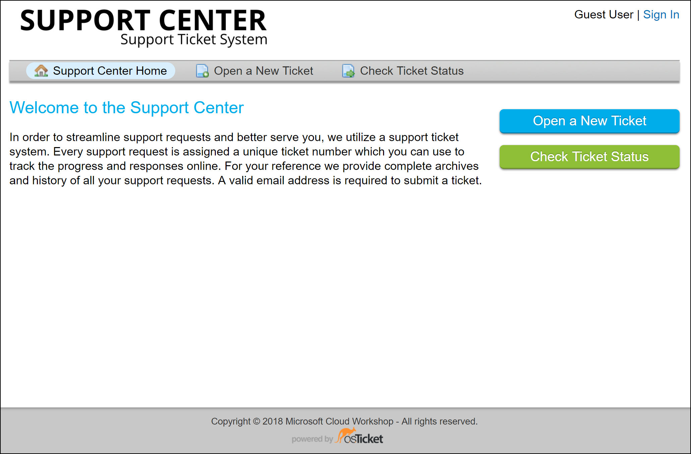

17. Choose the Sign in link.

    

18. Locate **I'm an agent**, and select the **sign in here** link.

    

19. At the OsTicket screen, enter the **username** and **password** and choose **Log In**.

    -   Username: ***demouser***

    -   Password: ***demo\@pass123***

    

20. Once logged into the OsTicket system, select **My Tickets**.

    

21. On the **My Tickets** screen, move through to one of the tickets. Congratulations, you have successfully deployed the application.

### Task 4: Configure your GitHub repo to notify Jenkins of changes

You will now configure your GitHub repository to notify your Jenkins server when a change has occurred, so the Jenkins Job is kicked off automatically.

1.  Log into your GitHub repo ([https://github.com/\<username\>/osTicket](https://github.com/%3cusername%3e/osticket)), and choose **Settings** followed by **Integration & services**.

    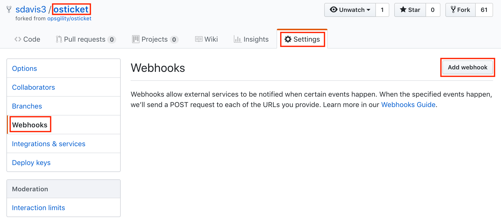

2.  Select **Add service**, and choose **Jenkins (GitHub plugin)**.

    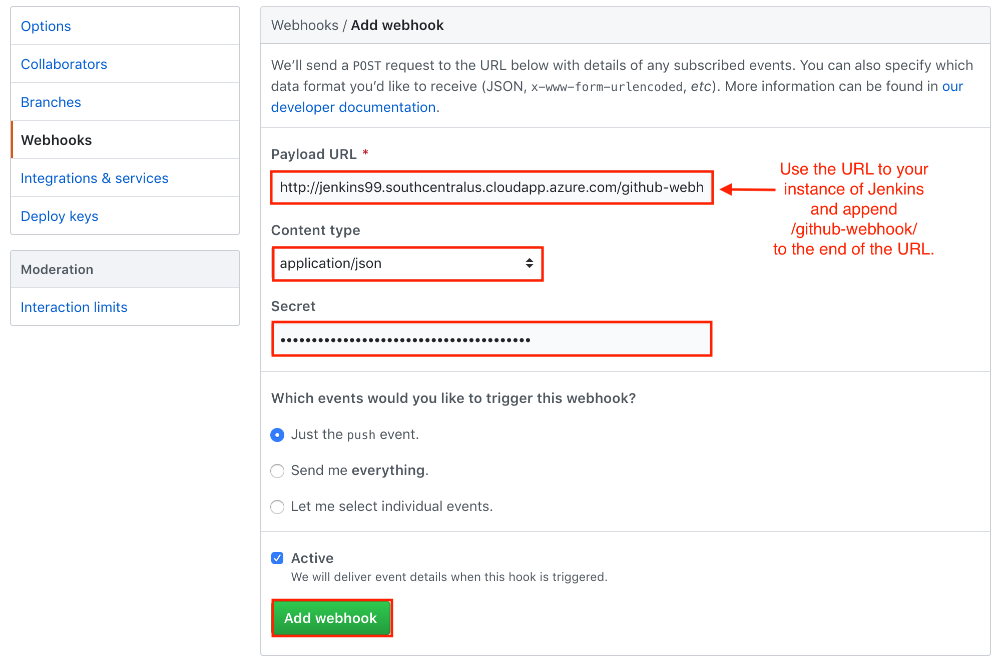

3.  For the Jenkins hook URL, enter the following (after updating the string with your servers FQDN). 

>**Note the trailing slash (/)** -- make sure it is included in your URL:

   

### Task 5: Check in a change to trigger Jenkins job

You will now check in a change to your Web Application code that will trigger your Jenkins job by editing the file that updates the home page.

1.  Open the following file in an editor such as Visual Studio Code **osTicket\\include\\client \\footer.inc.php**.

2.  Choose Ctrl+F, and find the following HTML code:

    ```
    All rights reserved.</p>
    ```

3.  Make a modification to the text and select FileSave.

    ```
    All rights reserved. Run on Azure App Services!</p>
    ```

4.  Move to a **Git Shell**, and execute the following git commands from the directory where the repo resides to push the update to your repository in GitHub.

    ```
    git config user.name "Your Name"

    git config user.email "your@email.com"

    git add -A

    git commit -m "updated model"

    git push
    ```

>**Note**: You may be required to authenticate using your github.com username and password.

5.  Now that a change has been checked in, there are various places to check that the process has worked. Start by checking that the staging website has been updated. 

>**Note**: The deployment will take a few moments.

   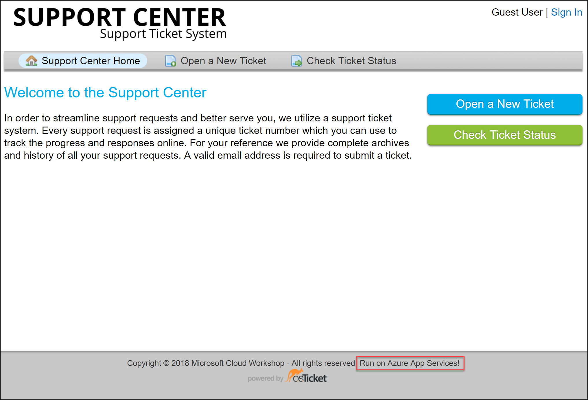

6.  You can also check logs in Jenkins. From the home page of your Jenkins portal, select the drop-down of your Jenkins job, and choose **GitHub Hook Log**.

    

7.  You can also check the Build History log and Console Output of the Jenkins project.

    

### Task 6: Manually deploy to production

Up to this point, you have automated the integration and delivery to your staging slot. You will now move those changes into the production slot *manually*. Leveraging the tools you have configured so far, you could ultimately automate this last step to get continuous deployment.

1.  To push the changes from your staging slot to production, in the Azure portal (<https://portal.azure.com>), select **Resource groups \> OsTicketPaaSRG** and then select your App Service.

    

2.  Select **Deployment slots \> Swap**.

    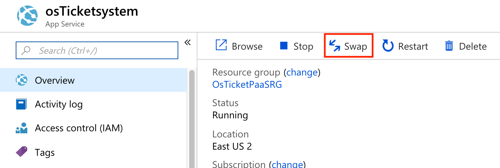

3.  Be sure that **Staging** is listed as the **Source** and **production** as the **Destination**, and choose **OK**.

    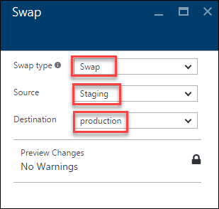

4.  Once the Swap has completed, verify the changes have been pushed to your production slot by browsing to your production URL.

    

### Summary

In this exercise, you leveraged Azure, Jenkins and GitHub to setup continuous integration, delivery, and deployment for your web site. You built a scenario where your code changes were automatically pushed out to a staging slot after collecting assets from GitHub.

## After the hands-on lab 

Duration: 10 minutes

### Task 1: Delete Resources

1.  Now that the Hands-on lab is complete, go ahead and delete all the Resource Groups that were created for this lab. You will no longer need those resources and it will be beneficial to clean up your Azure Subscription.

You should follow all steps provided *after* attending the Hands-on lab.
